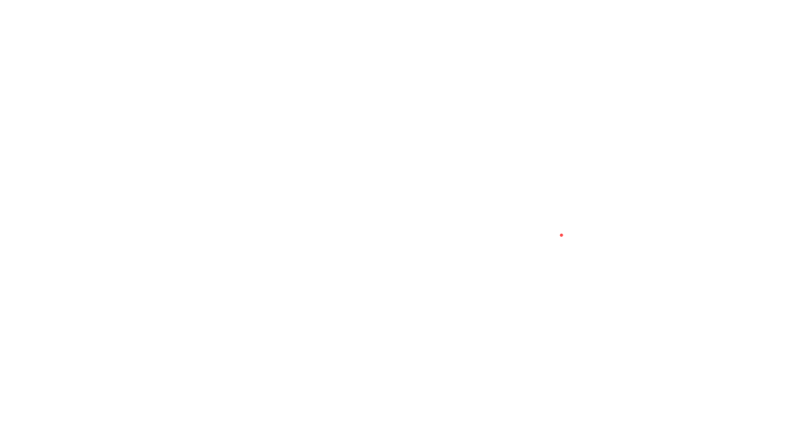

# Skill perfil-rrhh-pdf-word-pdf

Skill para **Claude Code**: a partir de un CV en PDF genera **dos versiones Word** (enfoque corporativo / enfoque logros y negocio), las **evalúa con una rúbrica RR.HH.** y exporta la elegida a **PDF**. La salida va a `output/` en la raíz del repositorio.

## Arquitectura



## Requisitos

- [Claude Code](https://claude.ai/code) con este proyecto abierto como workspace.
- **Python 3.10+** y dependencias del skill (ver abajo).
- Para el paso final **PDF**: [LibreOffice](https://www.libreoffice.org/) (`soffice`) o Microsoft Word instalado (vía `docx2pdf` y flag `--word` en el script).

## Instalación (una vez)

En la terminal integrada de Claude Code, desde el directorio del skill:

```bash
cd .claude/skills/perfil-rrhh-pdf-word-pdf/
pip install -r requirements.txt
```

Opcional (recomendado): entorno virtual.

```bash
python3 -m venv .venv
source .venv/bin/activate   # Windows: .venv\Scripts\activate
pip install -r requirements.txt
```

Si el PDF está **escaneado** (sin texto seleccionable), hace falta OCR; resumen en `.claude/skills/perfil-rrhh-pdf-word-pdf/reference.md`.

## Uso en Claude Code

1. Abre este repo en Claude Code. El skill se descubre por `.claude/skills/perfil-rrhh-pdf-word-pdf/SKILL.md`.
2. En el chat, pide el flujo completo e indica la **ruta absoluta o relativa** de tu PDF, por ejemplo:

   *«Usa el skill perfil-rrhh-pdf-word-pdf: mi CV está en `/ruta/al/cv.pdf`. Ejecuta extracción, dos versiones Word con análisis RR.HH. completos, rúbrica y PDF final en `output/`.»*

3. Si el asistente no aplica el skill, indícalo explícitamente:

   *«Sigue las instrucciones de `.claude/skills/perfil-rrhh-pdf-word-pdf/SKILL.md`.»*

4. El agente debe ejecutar los scripts desde el directorio del skill (`python scripts/...`) y escribir en `../../../output/` o usar la ruta que devuelve `bash scripts/prepare_output.sh`.

## Qué obtienes

| Artefacto (típico) | Descripción |
|--------------------|-------------|
| `output/extracted.txt` | Texto extraído del PDF |
| `output/payload_v1.json` / `payload_v2.json` | Datos para los dos documentos |
| `output/perfil_v1_rrhh_corporativo.docx` | Versión tema corporativo |
| `output/perfil_v2_rrhh_logros.docx` | Versión tema ejecutivo / logros |
| `output/perfil_rrhh_final.pdf` | PDF de la versión elegida tras la rúbrica |

Los detalles del JSON, la rúbrica y el checklist paso a paso están en **`SKILL.md`**. Guía adicional del repositorio: **`CLAUDE.md`**.

## Estructura relevante

```
.claude/skills/perfil-rrhh-pdf-word-pdf/
  SKILL.md          # Instrucciones completas del skill
  reference.md      # OCR, LibreOffice, Word, rúbrica extendida
  requirements.txt
  scripts/          # extract_pdf_text, build_docx, docx_to_pdf, prepare_output
output/             # Salidas generadas (la carpeta existe; el contenido suele ignorarse en git)
```
